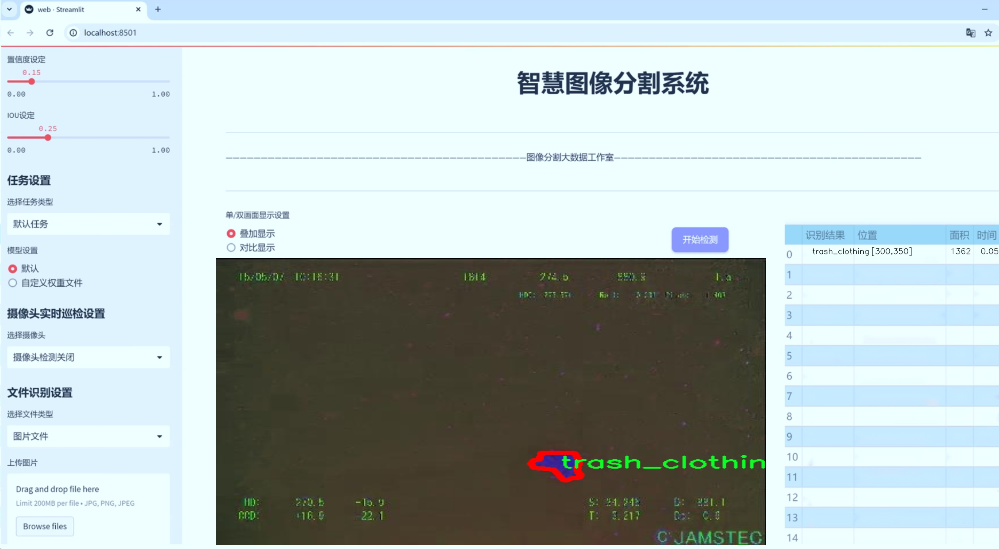
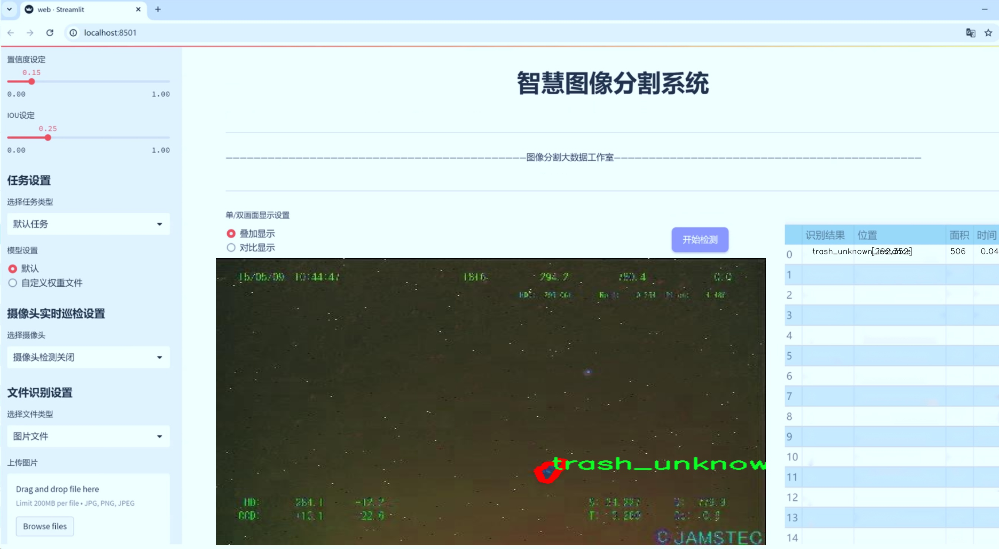
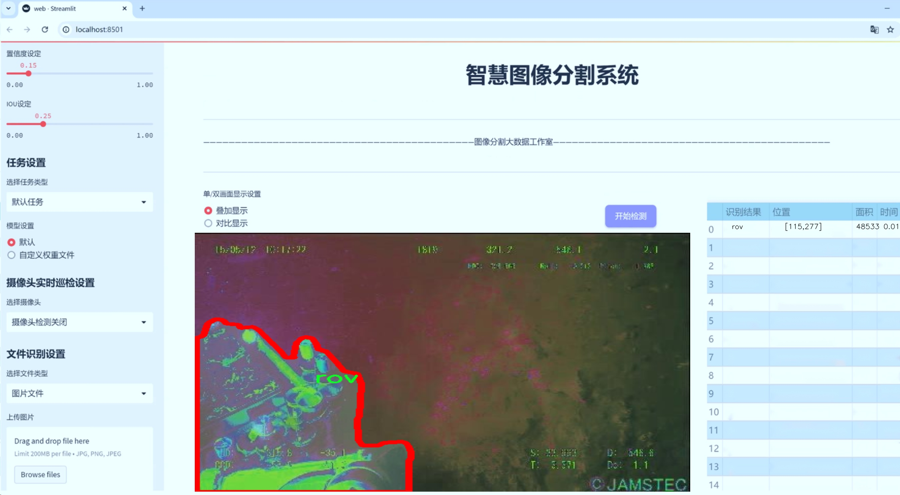
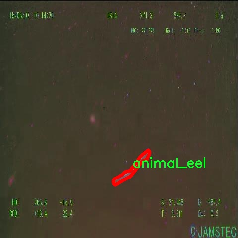
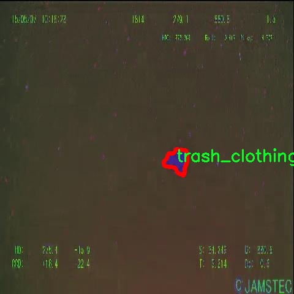
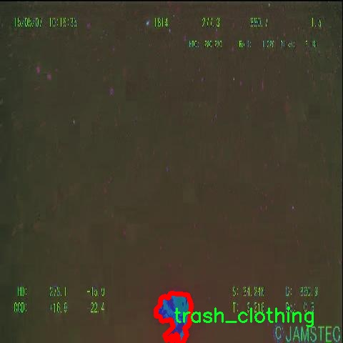
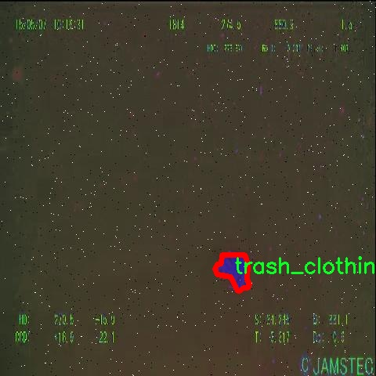
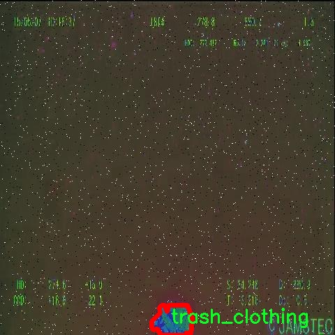

# 海洋垃圾分割系统源码＆数据集分享
 [yolov8-seg-C2f-EMSCP＆yolov8-seg-fasternet-bifpn等50+全套改进创新点发刊_一键训练教程_Web前端展示]

### 1.研究背景与意义

项目参考[ILSVRC ImageNet Large Scale Visual Recognition Challenge](https://gitee.com/YOLOv8_YOLOv11_Segmentation_Studio/projects)

项目来源[AAAI Global Al lnnovation Contest](https://kdocs.cn/l/cszuIiCKVNis)

研究背景与意义

随着全球经济的快速发展和人口的不断增长，海洋环境面临着前所未有的压力。海洋垃圾，尤其是塑料垃圾，已成为全球性环境问题之一。根据联合国环境规划署的报告，全球每年有超过800万吨的塑料垃圾流入海洋，这不仅对海洋生态系统造成了严重威胁，也对人类的生存环境产生了深远影响。海洋垃圾不仅影响海洋生物的生存与繁衍，还通过食物链的传递，最终危害到人类的健康。因此，开展海洋垃圾的监测与管理，尤其是高效的垃圾识别与分割技术，显得尤为重要。

在此背景下，基于深度学习的图像处理技术逐渐成为海洋垃圾识别与分割的重要工具。YOLO（You Only Look Once）系列模型因其高效的实时检测能力而广泛应用于物体检测领域。YOLOv8作为该系列的最新版本，进一步提升了检测精度和速度，适用于复杂的海洋环境。然而，传统的YOLOv8模型在处理海洋垃圾的细粒度分割任务时，仍然存在一定的局限性，尤其是在多类别垃圾的识别与分割上。因此，改进YOLOv8模型以适应海洋垃圾的特征，成为当前研究的热点。

本研究将基于改进的YOLOv8模型，构建一个高效的海洋垃圾分割系统。我们使用的数据集“Debris_Clahe”包含7300张图像，涵盖22个类别的海洋垃圾与生物。这些类别不仅包括常见的塑料垃圾（如垃圾袋、瓶子、容器等），还包括海洋生物（如鱼、螃蟹、海星等）和植物等。这种多样化的类别设置为模型的训练提供了丰富的样本，有助于提高模型的泛化能力和准确性。

通过对该数据集的深入分析与处理，我们将能够有效提升YOLOv8在海洋垃圾分割任务中的表现。具体而言，改进的YOLOv8模型将通过引入新的特征提取方法和优化算法，增强对不同类别垃圾的识别能力。此外，模型还将结合实例分割技术，实现对海洋垃圾的精确分割，从而为后续的垃圾清理与管理提供数据支持。

本研究的意义不仅在于提升海洋垃圾分割的技术水平，更在于为海洋环境保护提供切实可行的解决方案。通过高效的垃圾识别与分割系统，我们能够为相关部门提供科学依据，推动海洋垃圾治理政策的制定与实施。同时，本研究也为深度学习在环境保护领域的应用提供了新的思路与实践，具有重要的学术价值与社会意义。通过这一研究，我们希望能够引起社会各界对海洋垃圾问题的关注，促进公众参与海洋环境保护，共同为可持续发展贡献力量。

### 2.图片演示







##### 注意：由于此博客编辑较早，上面“2.图片演示”和“3.视频演示”展示的系统图片或者视频可能为老版本，新版本在老版本的基础上升级如下：（实际效果以升级的新版本为准）

  （1）适配了YOLOV8的“目标检测”模型和“实例分割”模型，通过加载相应的权重（.pt）文件即可自适应加载模型。

  （2）支持“图片识别”、“视频识别”、“摄像头实时识别”三种识别模式。

  （3）支持“图片识别”、“视频识别”、“摄像头实时识别”三种识别结果保存导出，解决手动导出（容易卡顿出现爆内存）存在的问题，识别完自动保存结果并导出到tempDir中。

  （4）支持Web前端系统中的标题、背景图等自定义修改，后面提供修改教程。

  另外本项目提供训练的数据集和训练教程,暂不提供权重文件（best.pt）,需要您按照教程进行训练后实现图片演示和Web前端界面演示的效果。

### 3.视频演示

[3.1 视频演示](https://www.bilibili.com/video/BV1y8yaYUEv9/)

### 4.数据集信息展示

##### 4.1 本项目数据集详细数据（类别数＆类别名）

nc: 22
names: ['animal_crab', 'animal_eel', 'animal_etc', 'animal_fish', 'animal_shells', 'animal_starfish', 'plant', 'rov', 'trash_bag', 'trash_bottle', 'trash_branch', 'trash_can', 'trash_clothing', 'trash_container', 'trash_cup', 'trash_net', 'trash_pipe', 'trash_rope', 'trash_snack_wrapper', 'trash_tarp', 'trash_unknown_instance', 'trash_wreckage']


##### 4.2 本项目数据集信息介绍

数据集信息展示

在当前海洋环境保护的背景下，针对海洋垃圾的监测与处理显得尤为重要。为此，我们构建了一个名为“Debris_Clahe”的数据集，旨在为改进YOLOv8-seg的海洋垃圾分割系统提供强有力的支持。该数据集专注于海洋生态系统中的多种垃圾和生物物种，包含22个类别，涵盖了海洋中的动物、植物以及各种垃圾类型。这一多样化的类别设置，不仅有助于提升模型的分割精度，还能增强其在实际应用中的适应性。

“Debris_Clahe”数据集的类别包括多种海洋生物，如“animal_crab”、“animal_eel”、“animal_fish”、“animal_starfish”等，这些类别代表了海洋生态系统中的重要组成部分。通过对这些生物的准确识别与分割，研究人员能够更好地理解海洋生态的健康状况，进而采取相应的保护措施。此外，数据集中还包含了“animal_etc”和“animal_shells”等类别，以涵盖更多的海洋生物多样性。

与此同时，数据集中的垃圾类别则反映了海洋污染的现状，具体包括“trash_bag”、“trash_bottle”、“trash_can”、“trash_clothing”等多种常见的海洋垃圾。这些垃圾不仅对海洋生物造成威胁，还对整个生态系统的平衡产生了深远的影响。通过对这些垃圾的有效识别与分类，模型能够为海洋清理工作提供重要的数据支持，帮助决策者制定更为科学的治理方案。

在数据集的构建过程中，我们特别关注了数据的多样性和代表性。每个类别的数据样本均经过精心挑选，确保其在不同环境、不同光照条件下的表现都能反映出真实的海洋场景。这种多样性不仅提高了模型的鲁棒性，也为后续的训练和测试提供了丰富的基础。我们相信，经过YOLOv8-seg模型的训练后，能够实现对海洋垃圾的高效分割，从而为海洋保护工作提供切实可行的技术支持。

此外，数据集还特别设计了“trash_unknown_instance”和“trash_wreckage”这两个类别，以应对那些难以分类的垃圾和潜在的海洋废弃物。这一设计考虑到了现实中垃圾种类繁多、形态各异的复杂性，旨在提升模型在面对未知情况时的应变能力。通过对这些未知实例的学习，模型能够不断优化自身的识别能力，从而在实际应用中表现得更加出色。

总之，“Debris_Clahe”数据集的构建不仅为海洋垃圾的分割与识别提供了坚实的基础，也为未来的海洋生态保护研究开辟了新的方向。我们期待通过这一数据集的应用，能够在海洋环境保护的道路上迈出更为坚实的步伐。











### 5.全套项目环境部署视频教程（零基础手把手教学）

[5.1 环境部署教程链接（零基础手把手教学）](https://www.bilibili.com/video/BV1jG4Ve4E9t/?vd_source=bc9aec86d164b67a7004b996143742dc)


[5.2 安装Python虚拟环境创建和依赖库安装视频教程链接（零基础手把手教学）](https://www.bilibili.com/video/BV1nA4VeYEze/?vd_source=bc9aec86d164b67a7004b996143742dc)

### 6.手把手YOLOV8-seg训练视频教程（零基础小白有手就能学会）

[6.1 手把手YOLOV8-seg训练视频教程（零基础小白有手就能学会）](https://www.bilibili.com/video/BV1cA4VeYETe/?vd_source=bc9aec86d164b67a7004b996143742dc)


按照上面的训练视频教程链接加载项目提供的数据集，运行train.py即可开始训练



     Epoch   gpu_mem       box       obj       cls    labels  img_size
     1/200     0G   0.01576   0.01955  0.007536        22      1280: 100%|██████████| 849/849 [14:42<00:00,  1.04s/it]
               Class     Images     Labels          P          R     mAP@.5 mAP@.5:.95: 100%|██████████| 213/213 [01:14<00:00,  2.87it/s]
                 all       3395      17314      0.994      0.957      0.0957      0.0843

     Epoch   gpu_mem       box       obj       cls    labels  img_size
     2/200     0G   0.01578   0.01923  0.007006        22      1280: 100%|██████████| 849/849 [14:44<00:00,  1.04s/it]
               Class     Images     Labels          P          R     mAP@.5 mAP@.5:.95: 100%|██████████| 213/213 [01:12<00:00,  2.95it/s]
                 all       3395      17314      0.996      0.956      0.0957      0.0845

     Epoch   gpu_mem       box       obj       cls    labels  img_size
     3/200     0G   0.01561    0.0191  0.006895        27      1280: 100%|██████████| 849/849 [10:56<00:00,  1.29it/s]
               Class     Images     Labels          P          R     mAP@.5 mAP@.5:.95: 100%|███████   | 187/213 [00:52<00:00,  4.04it/s]
                 all       3395      17314      0.996      0.957      0.0957      0.0845


### 7.50+种全套YOLOV8-seg创新点代码加载调参视频教程（一键加载写好的改进模型的配置文件）

[7.1 50+种全套YOLOV8-seg创新点代码加载调参视频教程（一键加载写好的改进模型的配置文件）](https://www.bilibili.com/video/BV1Hw4VePEXv/?vd_source=bc9aec86d164b67a7004b996143742dc)

### 8.YOLOV8-seg图像分割算法原理

原始YOLOv8-seg算法原理

YOLOv8-seg算法是YOLO系列目标检测模型的最新进展，旨在将目标检测与图像分割相结合，提供更为精确的物体识别和定位能力。该算法在YOLOv8的基础上进行了进一步的优化，尤其是在特征提取、特征融合和检测模块的设计上，旨在实现更高效的处理速度和更优的检测精度。

YOLOv8-seg的网络结构主要由三个核心部分组成：Backbone（骨干网络）、Neck（特征融合网络）和Head（检测模块）。在Backbone部分，YOLOv8-seg采用了CSPDarknet结构，这是一种改进的深度学习网络，旨在通过分段的方式增强特征提取能力。CSPDarknet通过将输入特征图分为多个分支，每个分支都经过卷积层的处理，最终再将这些分支的输出进行融合，从而形成更为丰富的特征表示。这种设计不仅提高了模型的表达能力，还在一定程度上减轻了计算负担。

在特征提取过程中，YOLOv8-seg引入了C2F模块替代传统的C3模块，C2F模块通过对特征图进行降维处理，能够有效保留重要的特征信息。C2F模块的设计理念是将特征图分为两个分支，分别进行卷积操作，进而堆叠多个分支以形成高维特征图。这种结构的优势在于能够更好地捕捉到不同尺度的特征信息，为后续的目标检测和分割提供了坚实的基础。

在Neck部分，YOLOv8-seg结合了特征金字塔网络（FPN）和路径聚合网络（PAN），形成了一个高效的特征融合模块。FPN的设计使得模型能够在不同的尺度上提取特征，而PAN则通过增强特征的上下文信息，进一步提升了模型对目标的定位能力。通过这种双塔结构，YOLOv8-seg能够有效地整合来自不同层次的特征信息，确保在处理复杂场景时，模型能够保持较高的准确性。

在Head部分，YOLOv8-seg采用了解耦头结构，这一设计使得回归分支和分类分支可以独立优化，从而加速模型的收敛过程。与传统的锚框检测方法不同，YOLOv8-seg采用无锚框的检测方式，直接预测目标的中心点和宽高比例。这种方法不仅减少了锚框的数量，还提高了检测的速度和准确度，使得模型在处理复杂背景和多目标场景时表现得更加出色。

此外，YOLOv8-seg在图像分割方面也进行了创新。通过引入语义分割的思想，YOLOv8-seg能够在目标检测的同时，对目标进行精确的像素级分割。这一功能的实现依赖于特征融合网络的强大能力，使得模型能够在不同尺度上捕捉到丰富的上下文信息，从而为分割任务提供支持。通过这种方式，YOLOv8-seg不仅能够识别出图像中的目标，还能够准确地 delineate 目标的边界，为后续的图像分析和处理提供了更多的可能性。

总的来说，YOLOv8-seg算法通过对YOLOv8的优化和扩展，成功地将目标检测与图像分割结合在一起，形成了一种高效、准确的深度学习模型。其轻量化的设计使得模型在保证性能的同时，能够在资源受限的环境中运行，为实际应用提供了更多的灵活性和便利性。随着YOLOv8-seg的不断发展，未来在智能监控、自动驾驶、医疗影像分析等领域的应用前景将更加广阔。


### 9.系统功能展示（检测对象为举例，实际内容以本项目数据集为准）

图9.1.系统支持检测结果表格显示

  图9.2.系统支持置信度和IOU阈值手动调节

  图9.3.系统支持自定义加载权重文件best.pt(需要你通过步骤5中训练获得)

  图9.4.系统支持摄像头实时识别

  图9.5.系统支持图片识别

  图9.6.系统支持视频识别

  图9.7.系统支持识别结果文件自动保存

  图9.8.系统支持Excel导出检测结果数据


### 10.50+种全套YOLOV8-seg创新点原理讲解（非科班也可以轻松写刊发刊，V11版本正在科研待更新）

#### 10.1 由于篇幅限制，每个创新点的具体原理讲解就不一一展开，具体见下列网址中的创新点对应子项目的技术原理博客网址【Blog】：


[10.1 50+种全套YOLOV8-seg创新点原理讲解链接](https://gitee.com/qunmasj/good)

#### 10.2 部分改进模块原理讲解(完整的改进原理见上图和技术博客链接)【如果此小节的图加载失败可以通过CSDN或者Github搜索该博客的标题访问原始博客，原始博客图片显示正常】

### Gold-YOLO简介
YOLO再升级：华为诺亚提出Gold-YOLO，聚集-分发机制打造新SOTA
在过去的几年中，YOLO系列模型已经成为实时目标检测领域的领先方法。许多研究通过修改架构、增加数据和设计新的损失函数，将基线推向了更高的水平。然而以前的模型仍然存在信息融合问题，尽管特征金字塔网络（FPN）和路径聚合网络（PANet）已经在一定程度上缓解了这个问题。因此，本研究提出了一种先进的聚集和分发机制（GD机制），该机制通过卷积和自注意力操作实现。这种新设计的模型被称为Gold-YOLO，它提升了多尺度特征融合能力，在所有模型尺度上实现了延迟和准确性的理想平衡。此外，本文首次在YOLO系列中实现了MAE风格的预训练，使得YOLO系列模型能够从无监督预训练中受益。Gold-YOLO-N在COCO val2017数据集上实现了出色的39.9% AP，并在T4 GPU上实现了1030 FPS，超过了之前的SOTA模型YOLOv6-3.0-N，其FPS相似，但性能提升了2.4%。


#### Gold-YOLO


YOLO系列的中间层结构采用了传统的FPN结构，其中包含多个分支用于多尺度特征融合。然而，它只充分融合来自相邻级别的特征，对于其他层次的信息只能间接地进行“递归”获取。

传统的FPN结构在信息传输过程中存在丢失大量信息的问题。这是因为层之间的信息交互仅限于中间层选择的信息，未被选择的信息在传输过程中被丢弃。这种情况导致某个Level的信息只能充分辅助相邻层，而对其他全局层的帮助较弱。因此，整体上信息融合的有效性可能受到限制。
为了避免在传输过程中丢失信息，本文采用了一种新颖的“聚集和分发”机制（GD），放弃了原始的递归方法。该机制使用一个统一的模块来收集和融合所有Level的信息，并将其分发到不同的Level。通过这种方式，作者不仅避免了传统FPN结构固有的信息丢失问题，还增强了中间层的部分信息融合能力，而且并没有显著增加延迟。


# 8.低阶聚合和分发分支 Low-stage gather-and-distribute branch
从主干网络中选择输出的B2、B3、B4、B5特征进行融合，以获取保留小目标信息的高分辨率特征。


低阶特征对齐模块 (Low-stage feature alignment module)： 在低阶特征对齐模块（Low-FAM）中，采用平均池化（AvgPool）操作对输入特征进行下采样，以实现统一的大小。通过将特征调整为组中最小的特征大小（ R B 4 = 1 / 4 R ） （R_{B4} = 1/4R）（R 
B4 =1/4R），我们得到对齐后的特征F a l i g n F_{align}F align 。低阶特征对齐技术确保了信息的高效聚合，同时通过变换器模块来最小化后续处理的计算复杂性。其中选择 R B 4 R_{B4}R B4 作为特征对齐的目标大小主要基于保留更多的低层信息的同时不会带来较大的计算延迟。
低阶信息融合模块(Low-stage information fusion module)： 低阶信息融合模块（Low-IFM）设计包括多层重新参数化卷积块（RepBlock）和分裂操作。具体而言，RepBlock以F a l i g n ( c h a n n e l = s u m ( C B 2 ， C B 3 ， C B 4 ， C B 5 ) ) F_{align} (channel= sum(C_{B2}，C_{B3}，C_{B4}，C_{B5}))F align (channel=sum(C B2 ，C B3 ，C B4 ，C B5 )作为输入，并生成F f u s e ( c h a n n e l = C B 4 + C B 5 ) F_{fuse} (channel= C_{B4} + C_{B5})F fuse (channel=C B4 +C B5 )。其中中间通道是一个可调整的值（例如256），以适应不同的模型大小。由RepBlock生成的特征随后在通道维度上分裂为F i n j P 3 Finj_P3Finj P 3和F i n j P 4 Finj_P4Finj P 4，然后与不同级别的特征进行融合。


# 8.高阶聚合和分发分支 High-stage gather-and-distribute branch
高级全局特征对齐模块（High-GD）将由低级全局特征对齐模块（Low-GD）生成的特征{P3, P4, P5}进行融合。


高级特征对齐模块(High-stage feature alignment module)： High-FAM由avgpool组成，用于将输入特征的维度减小到统一的尺寸。具体而言，当输入特征的尺寸为{R P 3 R_{P3}R P3 , R P 4 R_{P4}R P4 , R P 5 R_{P 5}R P5 }时，avgpool将特征尺寸减小到该特征组中最小的尺寸（R P 5 R_{P5}R P5  = 1/8R）。由于transformer模块提取了高层次的信息，池化操作有助于信息聚合，同时降低了transformer模块后续步骤的计算需求。

Transformer融合模块由多个堆叠的transformer组成，transformer块的数量为L。每个transformer块包括一个多头注意力块、一个前馈网络（FFN）和残差连接。采用与LeViT相同的设置来配置多头注意力块，使用16个通道作为键K和查询Q的头维度，32个通道作为值V的头维度。为了加速推理过程，将层归一化操作替换为批归一化，并将所有的GELU激活函数替换为ReLU。为了增强变换器块的局部连接，在两个1x1卷积层之间添加了一个深度卷积层。同时，将FFN的扩展因子设置为2，以在速度和计算成本之间取得平衡。

信息注入模块(Information injection module)： 高级全局特征对齐模块（High-GD）中的信息注入模块与低级全局特征对齐模块（Low-GD）中的相同。在高级阶段，局部特征（Flocal）等于Pi，因此公式如下所示：


### 增强的跨层信息流动 Enhanced cross-layer information flow
为了进一步提升性能，从YOLOv8 中的PAFPN模块中得到启发，引入了Inject-LAF模块。该模块是注入模块的增强版，包括了一个轻量级相邻层融合（LAF）模块，该模块被添加到注入模块的输入位置。为了在速度和准确性之间取得平衡，设计了两个LAF模型：LAF低级模型和LAF高级模型，分别用于低级注入（合并相邻两层的特征）和高级注入（合并相邻一层的特征）。它们的结构如图5(b)所示。为了确保来自不同层级的特征图与目标大小对齐，在实现中的两个LAF模型仅使用了三个操作符：双线性插值（上采样过小的特征）、平均池化（下采样过大的特征）和1x1卷积（调整与目标通道不同的特征）。模型中的LAF模块与信息注入模块的结合有效地平衡了准确性和速度之间的关系。通过使用简化的操作，能够增加不同层级之间的信息流路径数量，从而提高性能而不显著增加延迟。


### 11.项目核心源码讲解（再也不用担心看不懂代码逻辑）

#### 11.1 ui.py

以下是对代码的核心部分进行提炼和详细注释的版本：

```python
import sys
import subprocess

def run_script(script_path):
    """
    使用当前 Python 环境运行指定的脚本。

    Args:
        script_path (str): 要运行的脚本路径

    Returns:
        None
    """
    # 获取当前 Python 解释器的路径
    python_path = sys.executable

    # 构建运行命令，使用 streamlit 运行指定的脚本
    command = f'"{python_path}" -m streamlit run "{script_path}"'

    # 执行命令，并等待其完成
    result = subprocess.run(command, shell=True)
    
    # 检查命令执行结果，如果返回码不为0，表示执行出错
    if result.returncode != 0:
        print("脚本运行出错。")

# 程序入口
if __name__ == "__main__":
    # 指定要运行的脚本路径
    script_path = "web.py"  # 这里可以替换为实际的脚本路径

    # 调用函数运行指定的脚本
    run_script(script_path)
```

### 代码注释说明：

1. **导入模块**：
   - `sys`：用于访问与 Python 解释器相关的变量和函数。
   - `subprocess`：用于创建新进程、连接到它们的输入/输出/错误管道，并获得返回码。

2. **run_script 函数**：
   - 该函数接受一个参数 `script_path`，表示要运行的 Python 脚本的路径。
   - 使用 `sys.executable` 获取当前 Python 解释器的路径，以确保使用正确的 Python 环境来运行脚本。
   - 构建一个命令字符串，使用 `streamlit` 模块运行指定的脚本。
   - 使用 `subprocess.run` 执行命令，并通过 `shell=True` 允许在 shell 中执行命令。
   - 检查命令的返回码，如果返回码不为0，表示脚本运行出错，打印错误信息。

3. **程序入口**：
   - `if __name__ == "__main__":` 确保只有在直接运行该脚本时才会执行以下代码。
   - 指定要运行的脚本路径 `script_path`，这里可以根据需要进行修改。
   - 调用 `run_script` 函数，传入指定的脚本路径以执行。

这个文件是一个 Python 脚本，主要功能是运行一个名为 `web.py` 的脚本。首先，文件导入了几个必要的模块，包括 `sys`、`os` 和 `subprocess`，以及一个自定义的模块 `abs_path`，这个模块可能用于获取文件的绝对路径。

在 `run_script` 函数中，首先获取当前 Python 解释器的路径，这通过 `sys.executable` 实现。接着，构建一个命令字符串，用于调用 `streamlit` 运行指定的脚本。`streamlit` 是一个用于构建数据应用的库，通常用于快速开发和展示数据可视化应用。

然后，使用 `subprocess.run` 方法执行这个命令。这个方法会在一个新的 shell 中运行命令，并等待其完成。如果命令执行后返回的状态码不为零，表示脚本运行出错，程序会打印出错误信息。

在文件的最后部分，使用 `if __name__ == "__main__":` 语句来确保当这个脚本被直接运行时，以下代码才会执行。这里指定了要运行的脚本路径为 `web.py`，并调用 `run_script` 函数来执行它。

总体来说，这个文件的主要功能是为一个 Streamlit 应用提供一个启动脚本，通过指定的路径运行 `web.py` 脚本，便于开发者快速启动和测试应用。

#### 11.2 ultralytics\nn\modules\utils.py

以下是经过简化和注释的核心代码部分：

```python
import torch
import torch.nn.functional as F

def multi_scale_deformable_attn_pytorch(value: torch.Tensor, value_spatial_shapes: torch.Tensor,
                                        sampling_locations: torch.Tensor,
                                        attention_weights: torch.Tensor) -> torch.Tensor:
    """
    多尺度可变形注意力机制。

    参数:
    - value: 输入特征图，形状为 (batch_size, num_channels, num_heads, embed_dims)
    - value_spatial_shapes: 特征图的空间形状，形状为 (num_levels, 2)
    - sampling_locations: 采样位置，形状为 (batch_size, num_queries, num_heads, num_levels, num_points, 2)
    - attention_weights: 注意力权重，形状为 (batch_size, num_heads, num_queries, num_levels, num_points)

    返回:
    - output: 经过多尺度可变形注意力后的输出，形状为 (batch_size, num_queries, num_heads * embed_dims)
    """

    # 获取输入的基本维度信息
    bs, _, num_heads, embed_dims = value.shape
    _, num_queries, _, num_levels, num_points, _ = sampling_locations.shape

    # 将输入特征图按照空间形状分割成多个层次
    value_list = value.split([H_ * W_ for H_, W_ in value_spatial_shapes], dim=1)

    # 将采样位置进行归一化处理
    sampling_grids = 2 * sampling_locations - 1
    sampling_value_list = []

    # 遍历每个层次的特征图
    for level, (H_, W_) in enumerate(value_spatial_shapes):
        # 将特征图调整为 (bs * num_heads, embed_dims, H_, W_) 形状
        value_l_ = (value_list[level].flatten(2).transpose(1, 2).reshape(bs * num_heads, embed_dims, H_, W_))

        # 将采样位置调整为 (bs * num_heads, num_queries, num_points, 2) 形状
        sampling_grid_l_ = sampling_grids[:, :, :, level].transpose(1, 2).flatten(0, 1)

        # 使用双线性插值从特征图中采样
        sampling_value_l_ = F.grid_sample(value_l_,
                                          sampling_grid_l_,
                                          mode='bilinear',
                                          padding_mode='zeros',
                                          align_corners=False)
        sampling_value_list.append(sampling_value_l_)

    # 调整注意力权重的形状
    attention_weights = attention_weights.transpose(1, 2).reshape(bs * num_heads, 1, num_queries,
                                                                  num_levels * num_points)

    # 计算最终输出
    output = ((torch.stack(sampling_value_list, dim=-2).flatten(-2) * attention_weights).sum(-1).view(
        bs, num_heads * embed_dims, num_queries))

    return output.transpose(1, 2).contiguous()  # 返回形状为 (batch_size, num_queries, num_heads * embed_dims)
```

### 代码注释说明：
1. **函数功能**：该函数实现了多尺度可变形注意力机制，主要用于从不同尺度的特征图中采样并结合注意力权重生成输出。
2. **输入参数**：
   - `value`：输入特征图，包含多个头的嵌入特征。
   - `value_spatial_shapes`：特征图的空间维度信息，指示每个层次的高度和宽度。
   - `sampling_locations`：指定采样位置的张量，包含多个查询的采样点。
   - `attention_weights`：每个查询对应的注意力权重，用于加权不同层次的采样结果。
3. **输出**：函数返回经过多尺度注意力机制处理后的输出张量，形状为 `(batch_size, num_queries, num_heads * embed_dims)`，即每个查询的特征表示。

这个程序文件是一个用于实现多尺度可变形注意力机制的工具模块，主要用于深度学习中的目标检测和图像处理任务。文件中包含了一些重要的函数和初始化方法，以下是对代码的逐行讲解。

首先，文件引入了一些必要的库，包括`copy`、`math`、`numpy`和`torch`等，这些库提供了深度学习和数学计算所需的基础功能。接着，定义了一个`__all__`变量，列出了该模块公开的函数名称。

`_get_clones(module, n)`函数用于创建一个给定模块的克隆列表。它使用`copy.deepcopy`来复制模块，以确保每个克隆都是独立的。

`bias_init_with_prob(prior_prob=0.01)`函数用于根据给定的概率值初始化卷积或全连接层的偏置。它使用了对数几率的计算公式，将概率转换为偏置值。

`linear_init_(module)`函数用于初始化线性模块的权重和偏置。它根据模块的权重形状计算一个边界值，并使用均匀分布初始化权重和偏置。

`inverse_sigmoid(x, eps=1e-5)`函数计算输入张量的反sigmoid函数。它对输入值进行限制，确保在计算对数时不会出现除零错误。

`multi_scale_deformable_attn_pytorch`函数实现了多尺度可变形注意力机制。该函数的输入包括值张量、空间形状、采样位置和注意力权重。函数首先获取输入张量的形状信息，然后将值张量根据空间形状进行分割。接着，计算采样网格，并对每个尺度的值进行采样。最后，函数根据注意力权重对采样值进行加权求和，并返回最终的输出。

整个模块的设计旨在为YOLO（You Only Look Once）等目标检测模型提供必要的工具和功能，特别是在处理多尺度特征和可变形注意力机制时。通过这些函数，用户可以方便地进行模型的初始化和特征提取，从而提高模型的性能和效率。

#### 11.3 ultralytics\nn\extra_modules\ops_dcnv3\test.py

以下是代码中最核心的部分，并附上详细的中文注释：

```python
import torch
from functions.dcnv3_func import DCNv3Function, dcnv3_core_pytorch

# 输入和输出的尺寸
H_in, W_in = 8, 8  # 输入图像的高度和宽度
N, M, D = 2, 4, 16  # N: 批量大小, M: 输出通道数, D: 特征维度
Kh, Kw = 3, 3  # 卷积核的高度和宽度
remove_center = False  # 是否移除中心点
P = Kh * Kw - remove_center  # 卷积核的有效点数
offset_scale = 2.0  # 偏移量的缩放因子
pad = 1  # 填充大小
dilation = 1  # 膨胀率
stride = 1  # 步幅
# 计算输出的高度和宽度
H_out = (H_in + 2 * pad - (dilation * (Kh - 1) + 1)) // stride + 1
W_out = (W_in + 2 * pad - (dilation * (Kw - 1) + 1)) // stride + 1

torch.manual_seed(3)  # 设置随机种子以确保可重复性

@torch.no_grad()
def check_forward_equal_with_pytorch_double():
    # 创建输入、偏移量和掩码
    input = torch.rand(N, H_in, W_in, M*D).cuda() * 0.01
    offset = torch.rand(N, H_out, W_out, M*P*2).cuda() * 10
    mask = torch.rand(N, H_out, W_out, M, P).cuda() + 1e-5
    mask /= mask.sum(-1, keepdim=True)  # 归一化掩码
    mask = mask.reshape(N, H_out, W_out, M*P)

    # 使用PyTorch的核心函数计算输出
    output_pytorch = dcnv3_core_pytorch(
        input.double(),
        offset.double(),
        mask.double(),
        Kh, Kw, stride, stride, Kh // 2, Kw // 2, dilation, dilation, M, D, offset_scale, remove_center).detach().cpu()

    # 使用自定义的DCNv3函数计算输出
    output_cuda = DCNv3Function.apply(
        input.double(),
        offset.double(),
        mask.double(),
        Kh, Kw, stride, stride, Kh // 2, Kw // 2, dilation, dilation, M, D, offset_scale,
        im2col_step=2, remove_center).detach().cpu()

    # 检查两个输出是否相近
    fwdok = torch.allclose(output_cuda, output_pytorch)
    max_abs_err = (output_cuda - output_pytorch).abs().max()  # 最大绝对误差
    max_rel_err = ((output_cuda - output_pytorch).abs() / output_pytorch.abs()).max()  # 最大相对误差
    print('>>> forward double')
    print(f'* {fwdok} check_forward_equal_with_pytorch_double: max_abs_err {max_abs_err:.2e} max_rel_err {max_rel_err:.2e}')

if __name__ == '__main__':
    check_forward_equal_with_pytorch_double()  # 调用检查函数
```

### 代码核心部分说明：
1. **参数设置**：定义了输入图像的尺寸、卷积核的尺寸、填充、步幅等参数，这些参数对卷积操作的输出形状和计算过程至关重要。
2. **随机输入生成**：使用`torch.rand`生成随机的输入、偏移量和掩码，以模拟真实的卷积操作。
3. **输出计算**：通过调用自定义的`DCNv3Function`和PyTorch的`dcnv3_core_pytorch`函数计算输出，并将结果从GPU转移到CPU以便后续处理。
4. **结果验证**：使用`torch.allclose`检查两个输出是否相近，并计算最大绝对误差和相对误差，以验证自定义实现的正确性。

### 注意事项：
- 代码中使用了CUDA（GPU加速），因此在运行时需要确保环境支持CUDA。
- 该代码片段是用于验证自定义卷积操作的正确性，适合用于深度学习框架的扩展和优化。

这个程序文件是一个用于测试深度学习模型中 DCNv3（Deformable Convolutional Networks v3）功能的脚本。它主要通过比较 PyTorch 原生实现和自定义 CUDA 实现的输出，来验证两者的前向和反向传播的正确性，以及性能测试。

首先，程序导入了一些必要的库，包括 PyTorch 和一些数学函数。接着，定义了一些输入参数，如输入的高度和宽度、通道数、卷积核的大小、填充、步幅等。这些参数将用于后续的测试。

程序中定义了多个函数。`check_forward_equal_with_pytorch_double` 和 `check_forward_equal_with_pytorch_float` 函数用于检查前向传播的输出是否一致。它们分别使用双精度和单精度浮点数生成随机输入、偏移量和掩码，然后调用自定义的 DCNv3 函数和 PyTorch 的核心函数进行计算，最后比较两者的输出结果，输出最大绝对误差和相对误差。

`check_backward_equal_with_pytorch_double` 和 `check_backward_equal_with_pytorch_float` 函数用于检查反向传播的梯度是否一致。它们生成随机输入并设置梯度计算的标志，调用前向传播函数并进行反向传播，随后比较两个实现的梯度结果，输出最大绝对误差和相对误差。

最后，`check_time_cost` 函数用于测试前向传播的时间开销。它生成较大的输入数据，并多次调用 DCNv3 函数以测量执行时间，帮助评估性能。

在 `__main__` 部分，程序依次调用上述检查函数，验证前向和反向传播的正确性，并进行时间性能测试。整体来看，这个脚本的目的是确保自定义的 DCNv3 实现与 PyTorch 的实现相符，并评估其性能。

#### 11.4 ultralytics\models\sam\modules\__init__.py

以下是代码的核心部分，并附上详细的中文注释：

```python
# Ultralytics YOLO 🚀, AGPL-3.0 license

# 这是一个用于目标检测的YOLO（You Only Look Once）模型的实现。
# YOLO模型以其高效性和准确性而闻名，适用于实时目标检测任务。

# 主要的功能包括：
# 1. 加载模型
# 2. 进行推理（即对输入图像进行目标检测）
# 3. 输出检测结果

# 下面是伪代码示例，展示了YOLO模型的基本结构和流程：

class YOLO:
    def __init__(self, model_path):
        # 初始化YOLO模型
        # model_path: 模型文件的路径
        self.model = self.load_model(model_path)  # 加载预训练模型

    def load_model(self, model_path):
        # 加载YOLO模型的具体实现
        # 这里可以使用深度学习框架（如PyTorch或TensorFlow）来加载模型
        pass

    def detect(self, image):
        # 对输入图像进行目标检测
        # image: 输入的图像数据
        results = self.model.predict(image)  # 使用模型进行推理
        return results  # 返回检测结果

# 使用示例
if __name__ == "__main__":
    yolo = YOLO("path/to/model")  # 创建YOLO对象并加载模型
    image = "path/to/image.jpg"  # 输入图像路径
    detections = yolo.detect(image)  # 进行目标检测
    print(detections)  # 输出检测结果
```

### 注释说明：
1. **类定义**：`class YOLO` 定义了一个YOLO类，封装了模型的加载和推理功能。
2. **初始化方法**：`__init__` 方法用于初始化YOLO对象，并加载指定路径的模型。
3. **加载模型**：`load_model` 方法负责加载YOLO模型的具体实现，通常使用深度学习框架。
4. **目标检测方法**：`detect` 方法接受输入图像并返回检测结果，通过调用模型的推理方法实现。
5. **使用示例**：在主程序中创建YOLO对象，加载模型，并对指定图像进行目标检测，最后输出检测结果。

以上是YOLO模型的核心部分及其注释，提供了对目标检测过程的基本理解。

这个文件是Ultralytics YOLO项目的一部分，具体位于`ultralytics/models/sam/modules/__init__.py`。文件的开头包含了一行注释，表明该项目使用的是AGPL-3.0许可证，并且与Ultralytics YOLO相关。AGPL-3.0是一种开源许可证，允许用户自由使用、修改和分发软件，但要求在分发时也必须提供源代码。

在Python中，`__init__.py`文件通常用于标识一个目录是一个包，并可以包含初始化代码或导入其他模块的代码。虽然具体的代码内容没有提供，但通常情况下，这个文件可能会包含对其他模块的导入，以便在使用这个包时能够方便地访问这些模块的功能。

在Ultralytics YOLO项目中，`sam`模块可能与特定的功能或算法相关，`modules`目录则可能包含多个相关的子模块或功能实现。通过在`__init__.py`中进行适当的导入，用户可以更方便地使用这些功能，而无需直接引用每个子模块。

总的来说，这个文件的主要作用是为Ultralytics YOLO项目的模块化结构提供支持，使得用户能够更方便地使用和扩展该项目的功能。

#### 11.5 ultralytics\nn\extra_modules\afpn.py

以下是经过简化和注释的核心代码部分：

```python
import torch
import torch.nn as nn
import torch.nn.functional as F
from ..modules.conv import Conv

# 定义基本的卷积块
class BasicBlock(nn.Module):
    def __init__(self, filter_in, filter_out):
        super(BasicBlock, self).__init__()
        # 定义两个卷积层
        self.conv1 = Conv(filter_in, filter_out, 3)
        self.conv2 = Conv(filter_out, filter_out, 3, act=False)

    def forward(self, x):
        residual = x  # 保存输入以便后续加回去
        out = self.conv1(x)  # 第一个卷积
        out = self.conv2(out)  # 第二个卷积
        out += residual  # 残差连接
        return self.conv1.act(out)  # 返回激活后的输出


# 定义上采样模块
class Upsample(nn.Module):
    def __init__(self, in_channels, out_channels, scale_factor=2):
        super(Upsample, self).__init__()
        # 定义上采样过程
        self.upsample = nn.Sequential(
            Conv(in_channels, out_channels, 1),  # 1x1卷积
            nn.Upsample(scale_factor=scale_factor, mode='bilinear')  # 双线性插值上采样
        )

    def forward(self, x):
        return self.upsample(x)  # 返回上采样后的输出


# 定义下采样模块
class Downsample_x2(nn.Module):
    def __init__(self, in_channels, out_channels):
        super(Downsample_x2, self).__init__()
        # 定义2倍下采样
        self.downsample = Conv(in_channels, out_channels, 2, 2, 0)

    def forward(self, x):
        return self.downsample(x)  # 返回下采样后的输出


# 自适应特征融合模块（ASFF）
class ASFF_2(nn.Module):
    def __init__(self, inter_dim=512):
        super(ASFF_2, self).__init__()
        self.inter_dim = inter_dim
        compress_c = 8  # 压缩通道数

        # 定义权重卷积层
        self.weight_level_1 = Conv(self.inter_dim, compress_c, 1)
        self.weight_level_2 = Conv(self.inter_dim, compress_c, 1)
        self.weight_levels = nn.Conv2d(compress_c * 2, 2, kernel_size=1, stride=1, padding=0)
        self.conv = Conv(self.inter_dim, self.inter_dim, 3)  # 融合后的卷积

    def forward(self, input1, input2):
        # 计算权重
        level_1_weight_v = self.weight_level_1(input1)
        level_2_weight_v = self.weight_level_2(input2)
        levels_weight_v = torch.cat((level_1_weight_v, level_2_weight_v), 1)
        levels_weight = self.weight_levels(levels_weight_v)
        levels_weight = F.softmax(levels_weight, dim=1)  # 归一化权重

        # 融合特征
        fused_out_reduced = input1 * levels_weight[:, 0:1, :, :] + input2 * levels_weight[:, 1:2, :, :]
        out = self.conv(fused_out_reduced)  # 融合后的卷积
        return out


# 定义主网络结构
class AFPN_P345(nn.Module):
    def __init__(self, in_channels=[256, 512, 1024], out_channels=256, factor=4):
        super(AFPN_P345, self).__init__()
        # 定义输入通道到压缩通道的卷积
        self.conv0 = Conv(in_channels[0], in_channels[0] // factor, 1)
        self.conv1 = Conv(in_channels[1], in_channels[1] // factor, 1)
        self.conv2 = Conv(in_channels[2], in_channels[2] // factor, 1)

        # 定义特征提取体
        self.body = BlockBody_P345([in_channels[0] // factor, in_channels[1] // factor, in_channels[2] // factor])

        # 定义输出卷积
        self.conv00 = Conv(in_channels[0] // factor, out_channels, 1)
        self.conv11 = Conv(in_channels[1] // factor, out_channels, 1)
        self.conv22 = Conv(in_channels[2] // factor, out_channels, 1)

    def forward(self, x):
        x0, x1, x2 = x  # 输入特征
        x0 = self.conv0(x0)  # 经过卷积
        x1 = self.conv1(x1)
        x2 = self.conv2(x2)

        out0, out1, out2 = self.body([x0, x1, x2])  # 特征提取
        out0 = self.conv00(out0)  # 输出卷积
        out1 = self.conv11(out1)
        out2 = self.conv22(out2)
        return [out0, out1, out2]  # 返回输出特征
```

### 代码说明：
1. **BasicBlock**: 定义了一个基本的卷积块，包含两个卷积层和残差连接。
2. **Upsample**: 定义了一个上采样模块，使用1x1卷积和双线性插值进行上采样。
3. **Downsample_x2**: 定义了一个2倍下采样模块，使用卷积进行下采样。
4. **ASFF_2**: 自适应特征融合模块，计算输入特征的权重并融合特征。
5. **AFPN_P345**: 主网络结构，负责特征的压缩、提取和输出。

这个程序文件定义了一些用于构建自适应特征金字塔网络（AFPN）的模块，主要是为了实现多尺度特征融合。文件中包含多个类，每个类都实现了特定的功能，以下是对代码的逐步讲解。

首先，文件导入了一些必要的库和模块，包括 `torch` 和 `torch.nn`，以及一些自定义的卷积和块模块。接着，定义了一些公共类名，以便在其他模块中引用。

`BasicBlock` 类实现了一个基本的残差块，包含两个卷积层和一个残差连接。它的 `forward` 方法接收输入，经过两个卷积层处理后与输入相加，最终返回经过激活函数处理的输出。

`Upsample` 和 `Downsample_x2`、`Downsample_x4`、`Downsample_x8` 类分别实现了上采样和不同倍数的下采样操作。每个下采样类都使用卷积操作来减小特征图的尺寸。

`ASFF_2`、`ASFF_3` 和 `ASFF_4` 类实现了自适应特征融合模块（ASFF），分别用于融合两个、三个和四个输入特征图。它们通过计算权重来对输入特征进行加权融合，使用 `softmax` 函数确保权重的归一化。

`BlockBody_P345` 和 `BlockBody_P2345` 类是网络的主体部分，分别处理三个和四个输入特征图。它们包含多个卷积块和自适应特征融合模块，负责在不同尺度上进行特征提取和融合。每个块的 `forward` 方法实现了输入特征图的处理流程，包括下采样、上采样和特征融合。

`AFPN_P345` 和 `AFPN_P2345` 类是自适应特征金字塔网络的主要实现，负责将输入特征图通过卷积和主体部分进行处理，并输出融合后的特征图。它们的构造函数中初始化了卷积层和主体部分，并在 `forward` 方法中定义了输入的处理流程。

最后，`BlockBody_P345_Custom` 和 `BlockBody_P2345_Custom` 类允许用户自定义块类型，以便在特定应用中使用不同的卷积块。

整体来看，这个文件实现了一个灵活的特征金字塔网络结构，支持多种输入特征图的处理和融合，适用于目标检测等计算机视觉任务。通过使用自适应特征融合，网络能够更好地利用不同尺度的特征，提高检测精度。

#### 11.6 train.py

以下是代码中最核心的部分，并附上详细的中文注释：

```python
import os
import torch
import yaml
from ultralytics import YOLO  # 导入YOLO模型

if __name__ == '__main__':  # 确保该模块被直接运行时才执行以下代码
    # 设置训练参数
    workers = 1  # 数据加载的工作进程数
    batch = 8  # 每个批次的样本数量
    device = "0" if torch.cuda.is_available() else "cpu"  # 检查是否有可用的GPU，选择设备

    # 获取数据集的yaml配置文件的绝对路径
    data_path = abs_path(f'datasets/data/data.yaml', path_type='current')

    # 将路径转换为Unix风格
    unix_style_path = data_path.replace(os.sep, '/')
    # 获取目录路径
    directory_path = os.path.dirname(unix_style_path)

    # 读取YAML文件，保持原有顺序
    with open(data_path, 'r') as file:
        data = yaml.load(file, Loader=yaml.FullLoader)

    # 修改数据集中训练、验证和测试集的路径
    if 'train' in data and 'val' in data and 'test' in data:
        data['train'] = directory_path + '/train'  # 设置训练集路径
        data['val'] = directory_path + '/val'      # 设置验证集路径
        data['test'] = directory_path + '/test'    # 设置测试集路径

        # 将修改后的数据写回YAML文件
        with open(data_path, 'w') as file:
            yaml.safe_dump(data, file, sort_keys=False)

    # 加载YOLO模型配置文件并加载预训练权重
    model = YOLO(r"C:\codeseg\codenew\50+种YOLOv8算法改进源码大全和调试加载训练教程（非必要）\改进YOLOv8模型配置文件\yolov8-seg-C2f-Faster.yaml").load("./weights/yolov8s-seg.pt")

    # 开始训练模型
    results = model.train(
        data=data_path,  # 指定训练数据的配置文件路径
        device=device,  # 指定使用的设备
        workers=workers,  # 指定使用的工作进程数
        imgsz=640,  # 指定输入图像的大小为640x640
        epochs=100,  # 指定训练的轮数为100
        batch=batch,  # 指定每个批次的大小
    )
```

### 代码核心部分说明：
1. **参数设置**：定义了数据加载的工作进程数、批次大小和设备选择（GPU或CPU）。
2. **数据路径处理**：读取YAML配置文件，修改训练、验证和测试集的路径，以确保它们指向正确的目录。
3. **模型加载**：加载YOLO模型的配置文件和预训练权重，为后续的训练做准备。
4. **模型训练**：调用`model.train()`方法开始训练，传入必要的参数，包括数据路径、设备、工作进程数、图像大小、训练轮数和批次大小。

这个程序文件 `train.py` 是一个用于训练 YOLO（You Only Look Once）模型的脚本，主要使用了 PyTorch 框架和 YOLOv8 的实现。以下是对代码的逐行解释。

首先，程序导入了一些必要的库，包括 `os`、`torch`、`yaml`、`ultralytics` 中的 YOLO 模型，以及用于处理路径的 `abs_path` 函数和用于绘图的 `matplotlib`。在这里，`matplotlib.use('TkAgg')` 设置了绘图的后端为 TkAgg。

接下来，程序的主逻辑放在 `if __name__ == '__main__':` 语句块中，确保该模块被直接运行时才会执行以下代码。首先，定义了一些参数：`workers` 设置为 1，表示使用一个工作进程；`batch` 设置为 8，表示每个批次的样本数量；`device` 则根据是否有可用的 GPU 选择使用 GPU（"0"）或 CPU（"cpu"）。

然后，程序通过 `abs_path` 函数获取数据集配置文件 `data.yaml` 的绝对路径，并将其转换为 Unix 风格的路径。接着，使用 `os.path.dirname` 获取数据集目录的路径。

程序打开 `data.yaml` 文件并读取其内容，使用 `yaml.load` 方法保持原有顺序。接下来，检查 YAML 文件中是否包含 'train'、'val' 和 'test' 项，如果存在，则将这些项的路径修改为相应的训练、验证和测试数据集的路径，并将修改后的内容写回 YAML 文件。

在模型加载部分，程序通过 `YOLO` 类加载指定的模型配置文件（`yolov8-seg-C2f-Faster.yaml`）和预训练权重（`yolov8s-seg.pt`）。这里的注释提醒用户不同模型对设备的要求不同，如果遇到错误，可以尝试其他模型配置文件。

最后，程序调用 `model.train` 方法开始训练模型，传入的数据包括训练数据的配置文件路径、设备、工作进程数量、输入图像大小（640x640）、训练的 epoch 数量（100）以及批次大小（8）。训练结果将保存在 `results` 变量中。

整体来看，这个脚本的功能是配置并启动 YOLOv8 模型的训练过程，用户可以根据自己的需求调整参数，如批次大小和训练的 epoch 数量。

### 12.系统整体结构（节选）

### 整体功能和构架概括

这个项目是一个基于 Ultralytics YOLO 的深度学习目标检测框架，主要用于实现和训练 YOLO 模型。项目的整体结构模块化，包含多个功能模块，便于扩展和维护。以下是项目的主要功能模块：

1. **模型定义与训练**：包括 YOLO 模型的定义、训练和评估功能。
2. **特征提取与融合**：实现了自适应特征金字塔网络（AFPN）和其他特征提取模块，增强了模型在多尺度特征处理上的能力。
3. **自定义操作**：实现了可变形卷积（DCNv3）等自定义操作，以提高模型的灵活性和性能。
4. **工具函数**：提供了一些实用的工具函数，用于模型的初始化、数据处理和结果评估。
5. **用户界面**：通过 `ui.py` 提供了一个简单的用户界面，用于启动和运行模型。

### 文件功能整理表

| 文件路径                                                | 功能描述                                                         |
|-------------------------------------------------------|------------------------------------------------------------------|
| `C:\codeseg\codenew\code\ui.py`                      | 提供一个简单的用户界面，用于启动和运行 `web.py` 脚本。          |
| `C:\codeseg\codenew\code\ultralytics\nn\modules\utils.py` | 实现多尺度可变形注意力机制的工具函数，包括模块克隆和初始化。     |
| `C:\codeseg\codenew\code\ultralytics\nn\extra_modules\ops_dcnv3\test.py` | 测试自定义 DCNv3 实现的前向和反向传播，确保与 PyTorch 实现一致。 |
| `C:\codeseg\codenew\code\ultralytics\models\sam\modules\__init__.py` | 标识模块包，并可能包含对其他模块的导入。                        |
| `C:\codeseg\codenew\code\ultralytics\nn\extra_modules\afpn.py` | 实现自适应特征金字塔网络（AFPN），用于多尺度特征融合。           |
| `C:\codeseg\codenew\code\train.py`                   | 配置并启动 YOLO 模型的训练过程，处理数据集和模型加载。          |
| `C:\codeseg\codenew\code\ultralytics\nn\backbone\SwinTransformer.py` | 实现 Swin Transformer 模型，作为特征提取器。                     |
| `C:\codeseg\codenew\code\model.py`                   | 定义模型结构和前向传播逻辑，可能包含 YOLO 模型的具体实现。       |
| `C:\codeseg\codenew\code\ultralytics\nn\autobackend.py` | 自动化后端处理功能，可能涉及数据加载和预处理。                   |
| `C:\codeseg\codenew\code\ultralytics\nn\extra_modules\ops_dcnv3\functions\__init__.py` | 标识 DCNv3 功能模块包，并可能包含对其他功能的导入。              |
| `C:\codeseg\codenew\code\ultralytics\nn\backbone\fasternet.py` | 实现 FastNet 模型，作为另一种特征提取器。                        |
| `C:\codeseg\codenew\code\ultralytics\models\sam\predict.py` | 实现模型的预测功能，处理输入数据并生成输出结果。                |
| `C:\codeseg\codenew\code\ultralytics\models\yolo\model.py` | 定义 YOLO 模型的具体结构和逻辑，处理目标检测任务。               |

这个表格概述了项目中各个文件的主要功能，便于理解项目的整体架构和各个模块之间的关系。

注意：由于此博客编辑较早，上面“11.项目核心源码讲解（再也不用担心看不懂代码逻辑）”中部分代码可能会优化升级，仅供参考学习，完整“训练源码”、“Web前端界面”和“50+种创新点源码”以“14.完整训练+Web前端界面+50+种创新点源码、数据集获取”的内容为准。

### 13.图片、视频、摄像头图像分割Demo(去除WebUI)代码

在这个博客小节中，我们将讨论如何在不使用WebUI的情况下，实现图像分割模型的使用。本项目代码已经优化整合，方便用户将分割功能嵌入自己的项目中。
核心功能包括图片、视频、摄像头图像的分割，ROI区域的轮廓提取、类别分类、周长计算、面积计算、圆度计算以及颜色提取等。
这些功能提供了良好的二次开发基础。

### 核心代码解读

以下是主要代码片段，我们会为每一块代码进行详细的批注解释：

```python
import random
import cv2
import numpy as np
from PIL import ImageFont, ImageDraw, Image
from hashlib import md5
from model import Web_Detector
from chinese_name_list import Label_list

# 根据名称生成颜色
def generate_color_based_on_name(name):
    ......

# 计算多边形面积
def calculate_polygon_area(points):
    return cv2.contourArea(points.astype(np.float32))

...
# 绘制中文标签
def draw_with_chinese(image, text, position, font_size=20, color=(255, 0, 0)):
    image_pil = Image.fromarray(cv2.cvtColor(image, cv2.COLOR_BGR2RGB))
    draw = ImageDraw.Draw(image_pil)
    font = ImageFont.truetype("simsun.ttc", font_size, encoding="unic")
    draw.text(position, text, font=font, fill=color)
    return cv2.cvtColor(np.array(image_pil), cv2.COLOR_RGB2BGR)

# 动态调整参数
def adjust_parameter(image_size, base_size=1000):
    max_size = max(image_size)
    return max_size / base_size

# 绘制检测结果
def draw_detections(image, info, alpha=0.2):
    name, bbox, conf, cls_id, mask = info['class_name'], info['bbox'], info['score'], info['class_id'], info['mask']
    adjust_param = adjust_parameter(image.shape[:2])
    spacing = int(20 * adjust_param)

    if mask is None:
        x1, y1, x2, y2 = bbox
        aim_frame_area = (x2 - x1) * (y2 - y1)
        cv2.rectangle(image, (x1, y1), (x2, y2), color=(0, 0, 255), thickness=int(3 * adjust_param))
        image = draw_with_chinese(image, name, (x1, y1 - int(30 * adjust_param)), font_size=int(35 * adjust_param))
        y_offset = int(50 * adjust_param)  # 类别名称上方绘制，其下方留出空间
    else:
        mask_points = np.concatenate(mask)
        aim_frame_area = calculate_polygon_area(mask_points)
        mask_color = generate_color_based_on_name(name)
        try:
            overlay = image.copy()
            cv2.fillPoly(overlay, [mask_points.astype(np.int32)], mask_color)
            image = cv2.addWeighted(overlay, 0.3, image, 0.7, 0)
            cv2.drawContours(image, [mask_points.astype(np.int32)], -1, (0, 0, 255), thickness=int(8 * adjust_param))

            # 计算面积、周长、圆度
            area = cv2.contourArea(mask_points.astype(np.int32))
            perimeter = cv2.arcLength(mask_points.astype(np.int32), True)
            ......

            # 计算色彩
            mask = np.zeros(image.shape[:2], dtype=np.uint8)
            cv2.drawContours(mask, [mask_points.astype(np.int32)], -1, 255, -1)
            color_points = cv2.findNonZero(mask)
            ......

            # 绘制类别名称
            x, y = np.min(mask_points, axis=0).astype(int)
            image = draw_with_chinese(image, name, (x, y - int(30 * adjust_param)), font_size=int(35 * adjust_param))
            y_offset = int(50 * adjust_param)

            # 绘制面积、周长、圆度和色彩值
            metrics = [("Area", area), ("Perimeter", perimeter), ("Circularity", circularity), ("Color", color_str)]
            for idx, (metric_name, metric_value) in enumerate(metrics):
                ......

    return image, aim_frame_area

# 处理每帧图像
def process_frame(model, image):
    pre_img = model.preprocess(image)
    pred = model.predict(pre_img)
    det = pred[0] if det is not None and len(det)
    if det:
        det_info = model.postprocess(pred)
        for info in det_info:
            image, _ = draw_detections(image, info)
    return image

if __name__ == "__main__":
    cls_name = Label_list
    model = Web_Detector()
    model.load_model("./weights/yolov8s-seg.pt")

    # 摄像头实时处理
    cap = cv2.VideoCapture(0)
    while cap.isOpened():
        ret, frame = cap.read()
        if not ret:
            break
        ......

    # 图片处理
    image_path = './icon/OIP.jpg'
    image = cv2.imread(image_path)
    if image is not None:
        processed_image = process_frame(model, image)
        ......

    # 视频处理
    video_path = ''  # 输入视频的路径
    cap = cv2.VideoCapture(video_path)
    while cap.isOpened():
        ret, frame = cap.read()
        ......
```


### 14.完整训练+Web前端界面+50+种创新点源码、数据集获取


# [下载链接：https://mbd.pub/o/bread/Zp2alZpr](https://mbd.pub/o/bread/Zp2alZpr)